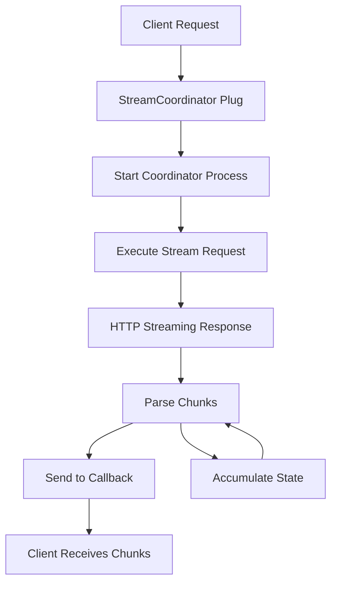

# ExLLM Pipeline Architecture

> **New in v0.9.0**: ExLLM now features a Phoenix-style pipeline architecture that provides both simple and advanced APIs through a composable plug system.

## Overview

ExLLM's pipeline architecture is inspired by Phoenix's Plug pattern, providing a composable, extensible way to process LLM requests. The architecture consists of:

1. **Request Structure** - Similar to Plug.Conn, carries all request data through the pipeline
2. **Plug Behavior** - Standardized interface for pipeline components
3. **Pipeline Runner** - Executes plugs in sequence with halting support
4. **Provider Pipelines** - Pre-configured pipelines for each LLM provider

## Architecture Layers

```
┌─────────────────────────────────────────────────────────────┐
│                     User Application                         │
├─────────────────────────────────────────────────────────────┤
│                    ExLLM Public API                         │
│         chat/3, stream/4, run/2, builder API               │
├─────────────────────────────────────────────────────────────┤
│                  ExLLM Pipeline Layer                       │
│    Plugs for validation, context, streaming, parsing       │
├─────────────────────────────────────────────────────────────┤
│               Tesla Middleware Stack                        │
│       HTTP client with retries, logging, telemetry        │
├─────────────────────────────────────────────────────────────┤
│                    Provider APIs                           │
│    OpenAI, Anthropic, Gemini, Groq, Mistral, etc.        │
└─────────────────────────────────────────────────────────────┘
```

## Core Components

### 1. Request Structure

The `ExLLM.Pipeline.Request` struct carries all data through the pipeline:

```elixir
%ExLLM.Pipeline.Request{
  # Identification
  id: "unique-request-id",
  provider: :openai,
  
  # Core data
  messages: [%{role: "user", content: "Hello"}],
  options: %{temperature: 0.7},
  config: %{model: "gpt-4", api_key: "..."},
  
  # Pipeline state
  halted: false,
  state: :pending,  # :pending | :executing | :completed | :error
  
  # HTTP client
  tesla_client: %Tesla.Client{},
  provider_request: %{},  # Formatted for provider
  
  # Response
  response: %Tesla.Env{},
  result: %{},  # Parsed ExLLM format
  
  # Communication
  assigns: %{},  # Inter-plug communication
  private: %{},  # Internal data
  
  # Tracking
  metadata: %{},
  errors: [],
  
  # Streaming
  stream_coordinator: pid(),
  stream_ref: reference()
}
```

### 2. Plug Behavior

All pipeline components implement the `ExLLM.Plug` behavior:

```elixir
defmodule MyCustomPlug do
  use ExLLM.Plug
  
  @impl true
  def init(opts) do
    # Initialize plug with options
    Keyword.validate!(opts, [:required_option])
  end
  
  @impl true
  def call(request, opts) do
    # Process request
    if valid?(request) do
      request
      |> Request.assign(:my_data, compute_data())
      |> Request.put_metadata(:processed_at, DateTime.utc_now())
    else
      Request.halt_with_error(request, %{
        plug: __MODULE__,
        error: :validation_failed,
        message: "Request validation failed"
      })
    end
  end
end
```

### 3. Pipeline Runner

The pipeline runner executes plugs in sequence:

```elixir
# Direct pipeline execution
pipeline = [
  ExLLM.Plugs.ValidateProvider,
  {ExLLM.Plugs.ManageContext, strategy: :truncate},
  ExLLM.Plugs.ExecuteRequest
]

request = ExLLM.Pipeline.Request.new(:openai, messages)
result = ExLLM.Pipeline.run(request, pipeline)

# Using the high-level API
{:ok, response} = ExLLM.run(request, pipeline)
```

## Built-in Plugs

### Core Plugs

- **ValidateProvider** - Ensures provider is supported
- **FetchConfig** - Merges configuration from all sources  
- **ManageContext** - Handles context window limits
- **BuildTeslaClient** - Creates HTTP client with middleware
- **Cache** - Response caching with TTL
- **TrackCost** - Calculates token usage and costs

### Execution Plugs

- **ExecuteRequest** - Performs synchronous HTTP requests
- **ExecuteStreamRequest** - Handles streaming responses
- **StreamCoordinator** - Manages streaming lifecycle

### Provider-Specific Plugs

- **OpenAIPrepareRequest** - Formats requests for OpenAI API
- **OpenAIParseResponse** - Parses OpenAI responses
- **OpenAIParseStreamResponse** - Parses SSE streaming format
- **AnthropicPrepareRequest** - Formats for Anthropic API
- **AnthropicParseResponse** - Parses Anthropic responses
- **AnthropicParseStreamResponse** - Parses event-based streaming

## Creating Custom Plugs

### Basic Plug

```elixir
defmodule MyApp.Plugs.RateLimiter do
  use ExLLM.Plug
  
  @impl true
  def init(opts) do
    Keyword.validate!(opts, [
      :max_requests,
      :window_seconds,
      bucket: :default
    ])
  end
  
  @impl true
  def call(request, opts) do
    bucket = opts[:bucket]
    
    if under_limit?(bucket, opts) do
      increment_counter(bucket)
      request
    else
      Request.halt_with_error(request, %{
        plug: __MODULE__,
        error: :rate_limited,
        message: "Rate limit exceeded"
      })
    end
  end
end
```

### Streaming Plug

```elixir
defmodule MyApp.Plugs.StreamLogger do
  use ExLLM.Plug
  
  @impl true
  def call(%Request{config: %{stream: true}} = request, _opts) do
    # Wrap the original callback
    original_callback = request.config[:stream_callback]
    
    wrapped_callback = fn chunk ->
      Logger.debug("Stream chunk: #{inspect(chunk)}")
      original_callback.(chunk)
    end
    
    Request.put_in(request, [:config, :stream_callback], wrapped_callback)
  end
  
  def call(request, _opts), do: request
end
```

## Provider Pipelines

Each provider has pre-configured pipelines:

### OpenAI Chat Pipeline

```elixir
[
  Plugs.ValidateProvider,
  Plugs.FetchConfig,
  {Plugs.ManageContext, strategy: :truncate},
  Plugs.BuildTeslaClient,
  {Plugs.Cache, ttl: 300},
  Plugs.Providers.OpenAIPrepareRequest,
  Plugs.ExecuteRequest,
  Plugs.Providers.OpenAIParseResponse,
  Plugs.TrackCost
]
```

### OpenAI Streaming Pipeline

```elixir
[
  Plugs.ValidateProvider,
  Plugs.FetchConfig,
  {Plugs.ManageContext, strategy: :truncate},
  Plugs.BuildTeslaClient,
  Plugs.StreamCoordinator,
  Plugs.Providers.OpenAIPrepareRequest,
  Plugs.Providers.OpenAIParseStreamResponse,
  Plugs.ExecuteStreamRequest
]
```

## Using the Pipeline API

### High-Level API

The high-level API automatically selects the appropriate pipeline:

```elixir
# Simple chat
{:ok, response} = ExLLM.chat(:openai, messages, %{
  temperature: 0.7,
  model: "gpt-4"
})

# Streaming
ExLLM.stream(:anthropic, messages, %{stream: true}, fn chunk ->
  IO.write(chunk.content)
end)
```

### Low-Level Pipeline API

For advanced use cases, use the pipeline directly:

```elixir
# Custom pipeline
custom_pipeline = [
  ExLLM.Plugs.ValidateProvider,
  MyApp.Plugs.CustomAuth,
  ExLLM.Plugs.FetchConfig,
  MyApp.Plugs.RateLimiter,
  ExLLM.Plugs.BuildTeslaClient,
  ExLLM.Plugs.ExecuteRequest,
  MyApp.Plugs.CustomParser
]

request = ExLLM.Pipeline.Request.new(:custom_provider, messages)
{:ok, response} = ExLLM.run(request, custom_pipeline)
```

### Builder API

The fluent builder API provides a convenient way to construct requests:

```elixir
# Using the builder
{:ok, response} = 
  ExLLM.build(:openai)
  |> ExLLM.with_messages([
    %{role: "system", content: "You are a helpful assistant"},
    %{role: "user", content: "Hello!"}
  ])
  |> ExLLM.with_model("gpt-4")
  |> ExLLM.with_temperature(0.7)
  |> ExLLM.with_max_tokens(1000)
  |> ExLLM.execute()

# With custom pipeline modifications
{:ok, response} =
  ExLLM.build(:anthropic)
  |> ExLLM.with_messages(messages)
  |> ExLLM.prepend_plug(MyApp.Plugs.CustomAuth)
  |> ExLLM.append_plug(MyApp.Plugs.ResponseLogger)
  |> ExLLM.execute()
```

## Streaming Architecture

The streaming architecture uses a coordinator process to manage the streaming lifecycle:



### Streaming Components

1. **StreamCoordinator** - Manages the streaming lifecycle
2. **Provider Parse Plugs** - Parse provider-specific streaming formats
3. **ExecuteStreamRequest** - Handles HTTP streaming with Tesla

### Streaming Example

```elixir
# Configure streaming
messages = [%{role: "user", content: "Write a story"}]

# Collect chunks
chunks = []
callback = fn chunk ->
  chunks = [chunk | chunks]
  IO.write(chunk.content || "")
end

# Execute streaming request
ExLLM.stream(:openai, messages, %{
  model: "gpt-4",
  stream: true
}, callback)

# Chunks arrive asynchronously
# Each chunk contains incremental content
# Final chunk has done: true
```

## Error Handling

The pipeline provides comprehensive error handling:

```elixir
case ExLLM.chat(:openai, messages) do
  {:ok, response} ->
    # Success
    IO.puts(response.content)
    
  {:error, %{plug: plug, error: error, message: message}} ->
    # Pipeline error
    Logger.error("Pipeline error in #{plug}: #{error} - #{message}")
    
  {:error, reason} ->
    # Other error
    Logger.error("Request failed: #{inspect(reason)}")
end
```

### Custom Error Handling

```elixir
defmodule MyApp.Plugs.ErrorHandler do
  use ExLLM.Plug
  
  @impl true
  def call(%Request{errors: errors} = request, _opts) when errors != [] do
    # Handle accumulated errors
    Enum.each(errors, &log_error/1)
    
    # Optionally retry or transform
    request
  end
  
  def call(request, _opts), do: request
end
```

## Performance Considerations

### Pipeline Optimization

1. **Plug Ordering** - Place validation plugs early to fail fast
2. **Caching** - Use the Cache plug for expensive operations
3. **Context Management** - Choose appropriate truncation strategies
4. **Streaming** - Use streaming for large responses

### Example Optimized Pipeline

```elixir
optimized_pipeline = [
  # Fast validation first
  Plugs.ValidateProvider,
  MyApp.Plugs.QuickAuthCheck,
  
  # Then configuration
  Plugs.FetchConfig,
  
  # Context management before expensive operations
  {Plugs.ManageContext, strategy: :smart},
  
  # Cache before HTTP calls
  {Plugs.Cache, ttl: 600, key: &cache_key/1},
  
  # HTTP operations
  Plugs.BuildTeslaClient,
  Plugs.ExecuteRequest,
  
  # Response processing
  Plugs.Providers.OpenAIParseResponse,
  Plugs.TrackCost
]
```

## Testing with Pipelines

### Unit Testing Plugs

```elixir
defmodule MyApp.Plugs.CustomPlugTest do
  use ExUnit.Case
  
  alias ExLLM.Pipeline.Request
  alias MyApp.Plugs.CustomPlug
  
  test "processes valid requests" do
    request = Request.new(:openai, [%{role: "user", content: "test"}])
    result = CustomPlug.call(request, [])
    
    assert result.assigns.processed == true
    refute result.halted
  end
  
  test "halts invalid requests" do
    request = Request.new(:invalid, [])
    result = CustomPlug.call(request, [])
    
    assert result.halted
    assert [%{error: :invalid_provider}] = result.errors
  end
end
```

### Integration Testing

```elixir
defmodule MyApp.PipelineIntegrationTest do
  use ExUnit.Case
  
  test "custom pipeline processes requests end-to-end" do
    pipeline = [
      ExLLM.Plugs.ValidateProvider,
      MyApp.Plugs.CustomTransform,
      ExLLM.Plugs.Providers.MockHandler
    ]
    
    request = ExLLM.Pipeline.Request.new(:mock, [
      %{role: "user", content: "test message"}
    ])
    
    {:ok, response} = ExLLM.run(request, pipeline)
    
    assert response.content =~ "Mocked response"
    assert response.metadata.custom_processed == true
  end
end
```

## Migration Guide

See [MIGRATION_GUIDE.md](MIGRATION_GUIDE.md) for detailed instructions on migrating from the old API to the new pipeline architecture.

## Best Practices

1. **Keep Plugs Focused** - Each plug should have a single responsibility
2. **Use Assigns for Communication** - Pass data between plugs via assigns
3. **Handle Errors Gracefully** - Always provide meaningful error messages
4. **Document Plug Options** - Use @moduledoc to document plug behavior and options
5. **Test in Isolation** - Unit test each plug independently
6. **Consider Performance** - Profile pipelines to identify bottlenecks

## Future Enhancements

- **Conditional Pipelines** - Dynamic pipeline selection based on request attributes
- **Parallel Execution** - Run independent plugs in parallel
- **Pipeline Composition** - Combine pipelines for complex workflows
- **Metrics Collection** - Built-in performance monitoring
- **Pipeline Visualization** - Tools to visualize and debug pipelines